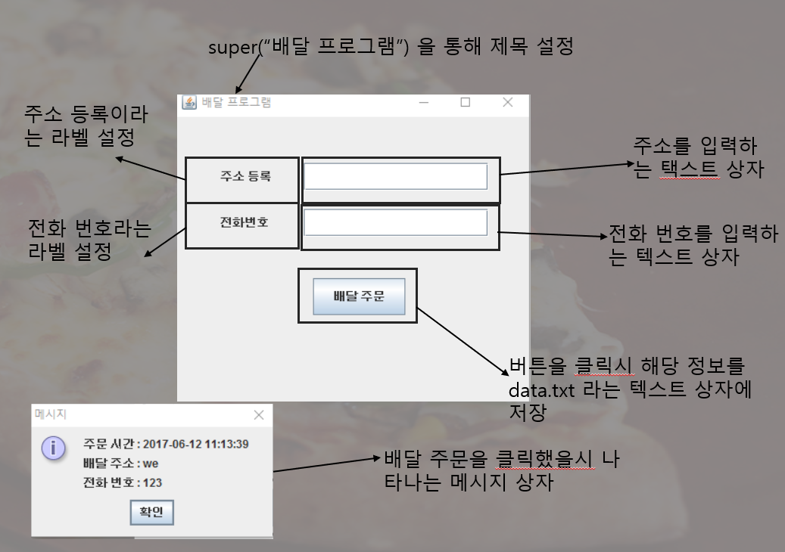

# 한림대학교 재학

## 이름: 이우열
## 연락처
- E-mail: dldndufzz@gmail.com
- Github: <https://github.com/Neeexus>
## 전공: 빅데이터 학과
  
### 관심분야

#### ●VR 프로그래밍
#### ●딥 러닝
#### ●게임 제작
#### ●정보보안

### 관련수강 과목

  

### 그 외의 프로그래밍 언어 및 스킬
  
- C 언어, Python,  C++, C#, Java, JavaScript, R 언어, Linux 등
  
### 대외 활동 및 자격증
  
- MOS Master
- 컴퓨터 활용능력 2급
- 컴퓨터 활용능력 1급
- 정보처리 기능사
- 2014년도 정보올림피아드 입상

### 그 외 활동
### 현역 시절 네트워크통신 운영병 보직 경험
- 네트워크통신 운영병 보직을 통해 각종 라우터와 및 네트워크 장비 경험  및 가설 작업 선로 작업을 2년 가까운 시간을 보내면서 라우터의 원리, 연결 및 동작 방법, 선로가 단선되었을 시 대처법을 경험해 보았습니다.  이를 통해 웬만한 통신에 관련된 작업은 가능하게 되었습니다.

---
### 프로젝트 및  개발경험
- C++ 메신저 프로그램
- Java를 이용한 피자 주문 시스템
- 라즈베리파이 구글어시스턴스api를 통한 스마트미러
- Unity 3D VR 방탈출게임
- 딥러닝을 통한 개 품종 분석기
- Python 영상처리를 통한 표정 분석 및 얼굴인식

---

## C++ 메신저 프로그램

### 기능 설명
- 사용자 계정을 생성 후, 다른 생성된 계정에게 메세지를 보내고 확인하는 기능을 구현했습니다.
- 메세지를 보낼 때 암호화를 하여 전송하고, 받는이의 입장에서는 복호화된 메세지를 수신받는 식으로 구현했습니다.
- 관리자 계정을 통해 사용자의 계정을 관리할 수 있도록 만들었고, 관리자는 비밀키 없이는 암호화된 메세지를 읽을 수 없게 구현했습니다.
- 로그아웃 기능을 구현하여 안전하게 이용하는 방식으로 구현했습니다.

---
## Java를 이용한 피자 주문 시스템

### 기능 설명
- 피자 매장을 가상으로 구현하여 피자가 주문되는 과정, 피자를 만드는 과정을 구현했습니다.
- 피자의 사이즈, 메뉴 및 토핑을 선택하여 주문할 수 있고, 주문 버튼을 통해 주소지 및 각종 인적사항을 써서 피자가 배달되는 가상의 시스템입니다.
- 피자의 주문 및 제작과정은 Thread를 통해 실제로 제작되는 것처럼 구현했습니다.
- 주문기록을 삭제하여 이미 사용한 정보는 삭제할 수 있게 구현했습니다.

---
# 라즈베리파이 구글어시스턴스api를 통한 스마트미러

### 기능 설명
- Coap을 이용한 스마트미러로 정보를 외부와 주고 받고 하는 식으로 구현했습니다.
- 구글 어이스턴스 api를 통한 스마트미러로 보일러 및 오늘의 날씨, 현재 방의 온도 등의 관한 정보를 출력하도록 구현했습니다.
- 실제 거울로는 제작되지 않았지만, 디스플레이에만 적용시키면 충분히 작동할 수 있게끔 구현했습니다.
- 실행 화면은 사진으로 올리기가 힘들어, 동영상으로 대체하겠습니다. 
- <https://drive.google.com/file/d/1HPuCtv-FuOoipa2cFs-eRnJbV1cMFJic/view?usp=sharing>
- <https://drive.google.com/file/d/1ah0odQsDbBQ98KKMeqoEzhJ0fYRDlNVZ/view?usp=sharing>
---
# Unity 3D VR 방탈출게임

---
### 기능 설명
- 해당 프로젝트는 Unity 3d VR로 구현하였으며, 핸드폰으로도 구글카드보드만 있으면 실제로 플레이가 가능하게끔 구현했습니다.
- '조' 라는 사람이 주인공을 납치하여 방에 가두고, 그 곳을 여러 단서를 찾아 탈출하는 게임입니다.
- 실행화면은 사진으로 올리기가 힘들어, 동영상으로 대체하겠습니다.
- <https://drive.google.com/file/d/1SSCBhbQk_rWht7afzCSOaP13PNfRPCCP/view?usp=sharing>

---
# 딥러닝을 통한 개 품종 분석기

### 기능 설명
- 사람과 강아지를 뉴럴네트워크를 통해 학습 후, 해당 강아지의 품종 및 사람이 강아지와 닮은 상을 출력하는 프로그램 입니다.
- 실험 했을때는 80%가 나왔습니다.
- 코드는 다음과 같습니다.
- <https://drive.google.com/file/d/1r9LRZB5S8p3J3Ri5d0xAXiYgLLpkBlp8/view?usp=sharing>
---
# Python 영상처리를 통한 표정 분석 및 얼굴인식

### 기능 설명
- 사람의 얼굴을 인식하여 그 옆에 하트, 텍스트, 썬글라스를 씌우는 프로그램입니다.
- 알파 블렌딩 및 이미지 마스킹을 통해 얼굴 인식한 부분을 추출하여 합성하는 작업을 하게끔 구현했습니다.
---
# Unity 3D AR을 통한 은행털기 게임

### 기능 설명
- 해당 프로젝트는 Vuforia를 이용하여 Unity AR을 통해 제작했습니다.
- 게임의 목표는 은행의 금고를 털어 안전하게 탈출하는 것입니다.
- 사진에 있는 가상 버튼을 통해 총을 발사하며, 이미지타겟을 통해 자물쇠를 열어 탈출하여 게임을 클리어합니다.
- 동영상으로 대체하겠습니다. <https://drive.google.com/file/d/107PAeL5r3qhAmaggH6v1qJum6p0cvGWo/view?usp=sharing>
---
### 프로젝트 링크
- C++ 메신저 프로그램 <https://github.com/Neeexus/Projects.git>
- Java를 이용한 피자주문 프로그램 <https://github.com/Neeexus/JavaProject.git>
- 라즈베리파이 구글어시스턴스api를 통한 스마트미러 <https://github.com/Neeexus/SmartMirror.git>
- Unity 3D VR 방탈출게임 <https://github.com/Neeexus/Unity3DVR.git>
- 딥러닝을 통한 개 품종 분석기 <https://github.com/Neeexus/DeepLearning.git>
- Python 영상처리를 통한 표정 분석 및 얼굴인식 <https://github.com/Neeexus/Image.git>
- Unity 3d AR 은행털기게임<https://github.com/Neeexus/ARproject>
